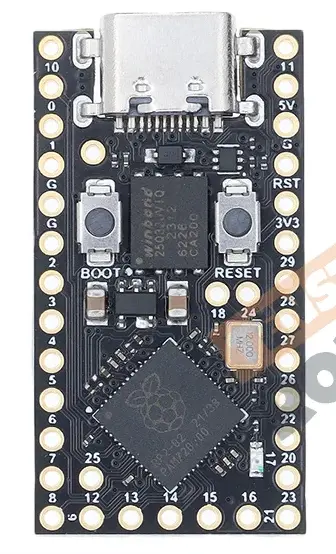
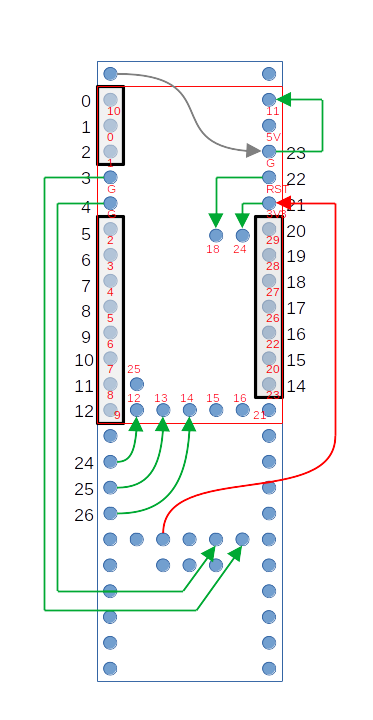

# KinT Controller Modded for RP2040

The [KinT Controller](https://github.com/kinx-project/kint) by Michael Stapelberg is a fantastic keyboard controller replacement for the Kinesis Advantage Contoured keyboards. However, the Teensy MCU's can be expensive and often difficult to obtain.

This project successfully replaces the Teensy with an RP2040 Pro Micro from Aliexpress. Look for the 27 GPIO version that looks like this:

 

### Special Note

This guide is only recommended for people who have spare PCB's designed for the Teensy and do not mind doing a little extra wiring to get it to work with a cheaper MCU. If you have not purchased any PCB's, you should consider the [KinT Controller - Blackpill Edition](https://github.com/dcpedit/kint), which has PCB files ready for ordering, and also uses a chip comparable in price and features as the RP2040.

# Instructions

Follow the instructions on the original [KinT Controller Repository](https://github.com/kinx-project/kint). However, when installing the board follow the below diagram:

1. The original Teensy outline is shown in blue, with the original Teensy labels in black.
2. The RP2040 is shown in red with the new GPIO pins also in red.
3. The only header pins that will map correctly are the ones enclosed in the black borders. So you will need to break up your headers into 4 pieces. 3-pin and 8-pin on the left, 2-pin across, and a 7-pin on the right. The rest are floating and must not be connected to the PCB.
4. The arrows are the additional wires needed. All of them route FROM the PCB TO the RP2040 board. 

# Programming QMK

The kintrp subfolder in this repository has the files necessary for a successful RP2040 build. It will do the following:

* Caps Lock, Num Lock, and Scroll Lock work as expected with LED's working. Keypad maps to Layer 1, which also activates the Keypad LED.
