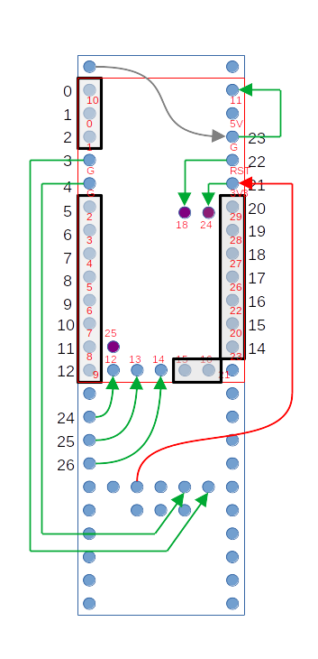

# KinT Controller Modded for RP2040

The [url=https://github.com/kinx-project/kint]KinT Controller[/url] by Michael Stapelberg is a fantastic keyboard controller replacement for the Kinesis Advantage Contoured keyboards. However, the Teensy MCU's can be expensive and often difficult to obtain.

This project successfully replaces the Teensy with an RP2040 Pro Micro from Aliexpress. Look for the 27 GPIO version that looks like this:

 

# Instructions

Follow the instructions on the original [url=https://github.com/kinx-project/kint]KinT Controller Repository[/url]. However, when installing the board follow the below diagram:

